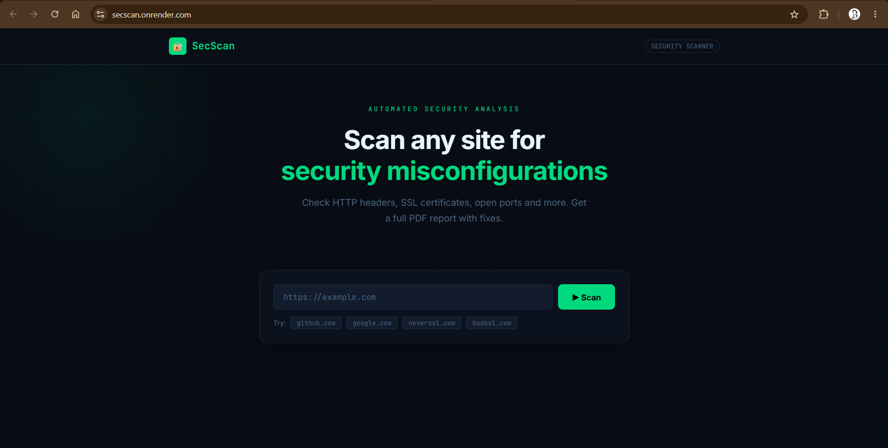
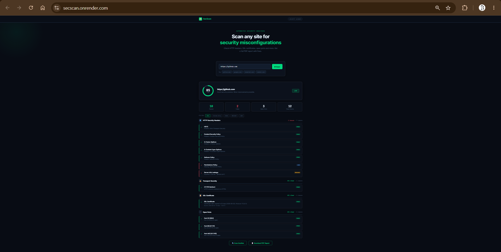
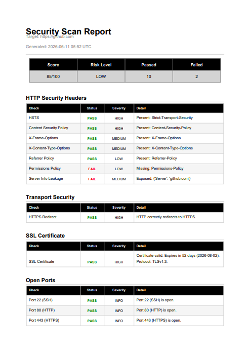

#  SecScan — Security Misconfiguration Scanner

A full-stack web application built with Django that automatically scans websites for security misconfigurations, generates risk scores, and produces downloadable PDF reports with remediation steps.

## Live Demo

**[https://secscan.onrender.com](https://secscan.onrender.com)**

> Note: First load may take 30–50 seconds on the free tier.

##  Screenshots

### Homepage


### Scan Results


### PDF Report


##  Features

| Feature | Description |
|--------|-------------|
|  HTTP Security Headers | Checks HSTS, CSP, X-Frame-Options, X-Content-Type-Options, Referrer-Policy, Permissions-Policy |
|  HTTPS Redirect | Verifies HTTP traffic is properly redirected to HTTPS |
|  SSL Certificate | Validates expiry, protocol version (TLS 1.2/1.3), cipher suite |
|  Port Scanner | Detects dangerous exposed ports — MySQL, Redis, MongoDB, Telnet, FTP |
|  Server Info Leakage | Finds headers that expose your tech stack to attackers |
|  Security Score | Weighted 0–100 score with LOW / MEDIUM / HIGH / CRITICAL risk rating |
|  PDF Reports | Professional downloadable reports with findings and fix recommendations |
|  Scan History | Search and filter all past scans saved to database |
|  Live Progress Bar | Real-time scanning steps shown during analysis |
|  Severity Filter | Filter results by HIGH / MEDIUM / LOW severity |

## Tech Stack

- **Backend** — Django 6, Python 3.12
- **Scanner Logic** — Python `requests`, `ssl`, `socket` libraries
- **PDF Generation** — ReportLab
- **Database** — SQLite (Django ORM)
- **Frontend** — Vanilla HTML, CSS, JavaScript

##  Project Structure
```
secscan/
├── scanner/                    # Main Django app
│   ├── templates/
│   │   └── scanner/
│   │       └── index.html      # Frontend UI
│   ├── screenshots/            # Project screenshots
│   ├── migrations/             # Database migrations
│   ├── models.py               # ScanResult database model
│   ├── security_checks.py      # Core scanning logic
│   ├── report_generator.py     # PDF report generation
│   ├── views.py                # API endpoints
│   └── urls.py                 # URL routing
├── secscan/                    # Django project config
│   ├── settings.py
│   └── urls.py
├── build.sh                    # Render build script
├── requirements.txt
└── manage.py
```
##  Setup & Installation

```bash
# Clone the repository
git clone https://github.com/brunda6git/secscan.git
cd secscan

# Create virtual environment
python -m venv venv
venv\Scripts\activate  # Windows
source venv/bin/activate  # Mac/Linux

# Install dependencies
pip install -r requirements.txt

# Run migrations
python manage.py migrate

# Start server
python manage.py runserver
```

Visit **http://127.0.0.1:8000**

## How It Works

1. User enters a URL and clicks Scan
2. Django receives the request and calls `security_checks.py`
3. Scanner makes real network requests using Python's `ssl`, `socket`, and `requests` libraries
4. Each check returns pass/fail with severity level
5. Score is calculated — HIGH failure = −25pts, MEDIUM = −10pts, LOW = −5pts
6. Results saved to database via Django ORM
7. User can download a full PDF report

## Disclaimer

For authorized security testing only. Only scan websites you own or have explicit permission to test.