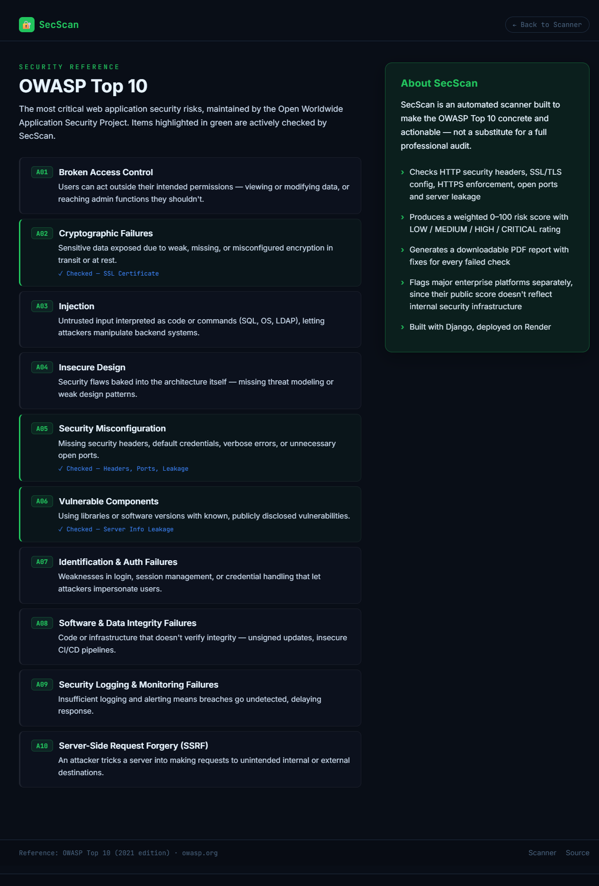

# 🔐 SecScan — Security Misconfiguration Scanner

A full-stack web application built with Django that automatically scans websites for security misconfigurations, generates risk scores, and produces downloadable PDF reports with remediation steps.

## Live Demo

**[https://secscan.onrender.com](https://secscan.onrender.com)**

> Note: First load may take 30–50 seconds on the free tier (cold start).

## Screenshots

### Homepage


### Scan Results Dashboard


### PDF Report


### OWASP Top 10 Reference


## Features

| Feature | Description |
|---|---|
| HTTP Security Headers | Checks HSTS, CSP, X-Frame-Options, X-Content-Type-Options, Referrer-Policy, Permissions-Policy |
| HTTPS Redirect | Verifies HTTP traffic is properly redirected to HTTPS |
| SSL Certificate | Validates expiry, protocol version (TLS 1.2/1.3) |
| Port Scanner | Detects dangerous exposed ports — MySQL, Redis, MongoDB, Telnet, FTP — with a confirmation pass to avoid false positives |
| Server Info Leakage | Finds headers that expose your tech stack to attackers |
| Security Score | Weighted 0–100 score with LOW / MEDIUM / HIGH / CRITICAL risk rating |
| Enterprise Detection | Flags major platforms (Google, GitHub, etc.) with a clear notice that a low score reflects public header compliance, not their actual security posture |
| PDF Reports | Professional downloadable reports with findings, "why it matters," and fix recommendations |
| Scan History | Collapsible dropdown with search/filter across all past scans |
| OWASP Top 10 Reference | Built-in page mapping each OWASP risk category to what SecScan actually checks |
| Live Progress Bar | Real-time scanning steps shown during analysis |
| Severity Filter | Filter results by HIGH / MEDIUM / LOW severity |
| Dark / Light Mode | Full theme toggle with saved preference |
| Responsive Design | Two-column dashboard on desktop, stacked layout on mobile |

## Tech Stack

- **Backend** — Django 6, Python 3.12
- **Scanner Logic** — Python `requests`, `ssl`, `socket` libraries, with retry logic for network reliability
- **PDF Generation** — ReportLab
- **Database** — SQLite (Django ORM)
- **Frontend** — Vanilla HTML, CSS, JavaScript, Chart.js
- **Deployment** — Render (Gunicorn + Whitenoise)

## Project Structure

```bash
secscan/
├── scanner/ 
│ ├── templates/
│ │ └── scanner/
│ │ ├── index.html
│ │ └── owasp.html 
│ ├── screenshots/ 
│ ├── migrations/ 
│ ├── models.py 
│ ├── security_checks.py 
│ ├── report_generator.py 
│ ├── views.py 
│ └── urls.py 
├── secscan/ 
│ ├── settings.py
│ └── urls.py
├── build.sh 
├── requirements.txt
└── manage.py
```

## Setup & Installation

```bash
# Clone the repository
git clone https://github.com/brunda6git/secscan.git
cd secscan

# Create virtual environment
python -m venv venv
venv\Scripts\activate  # Windows
source venv/bin/activate  # Mac/Linux

# Install dependencies
pip install -r requirements.txt

# Run migrations
python manage.py migrate

# Start server
python manage.py runserver
```

Visit **http://127.0.0.1:8000**

## How It Works

1. User enters a URL and clicks Scan
2. Django receives the request and calls `security_checks.py`
3. Scanner makes real network requests using Python's `ssl`, `socket`, and `requests` libraries — with retries on network checks to avoid transient failures skewing the score
4. Each check returns pass/fail with a severity level
5. Score is calculated — HIGH failure = −25pts, MEDIUM = −10pts, LOW = −5pts
6. Enterprise/major platforms are flagged separately so their score is interpreted correctly
7. Results are saved to the database via Django ORM
8. User can download a full PDF report or browse scan history

## Disclaimer

For authorized security testing only. Only scan websites you own or have explicit permission to test.